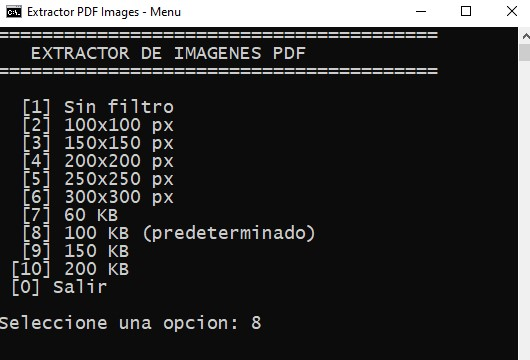
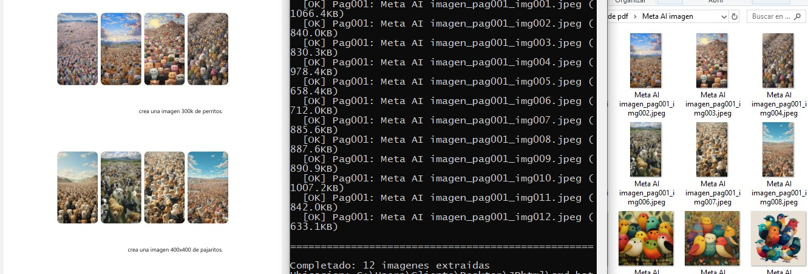

# Extractor de Imágenes de PDF

Herramienta técnica diseñada para la **recuperación de imágenes originales** desde archivos PDF generados a partir de sitios web (impresión a PDF). Está optimizada para extraer y filtrar imágenes basándose en dimensiones de píxeles o peso en kilobytes.

## ⚠️ Importante

Esta herramienta está diseñada específicamente para **PDFs generados por impresión web** (cuando imprimes una página web a PDF). Si el PDF no contiene imágenes o son PDFs escaneados sin imágenes embebidas, esta herramienta no funcionará como se espera.

## Funcionamiento

El script localiza automáticamente el primer PDF en su directorio y realiza lo siguiente:

1. **Organización**: Crea una carpeta con el mismo nombre del archivo PDF
2. **Extracción**: Guarda las imágenes originales extraídas directamente en esa carpeta
3. **Ubicación**: Todo el proceso se ejecuta de forma local en la ruta del archivo `.py`

## Vista Previa


*Interfaz del menú interactivo para seleccionar filtros de extracción.*


*Ejemplo de la estructura de carpetas e imágenes recuperadas.*

## Scripts de Automatización (Windows)

Se incluyen archivos por lotes (.bat) para simplificar el flujo de trabajo en Windows:

* **extraer 100k.bat**: Ejecución rápida con un filtro predeterminado de **100 KB**
* **extraer100kmenu.bat**: Interfaz con menú para elegir entre diversos filtros de píxeles (100px a 300px) o peso (60KB a 200KB)

### Notas sobre la automatización (PowerShell Integration)

El archivo `extraer100kmenu.bat` utiliza **PowerShell** para modificar dinámicamente la variable `FILTRO` dentro de `extract_pdf_images.py`:

* **Inyección de parámetros**: Usa expresiones regulares (`-replace`) para actualizar el código de Python en tiempo real
* **Flujo sin intervención**: Permite cambiar la lógica de filtrado desde la consola de Windows sin necesidad de editar manualmente el script

## Requisitos

* Python 3.x
* Dependencias: `pip install -r requirements.txt`
  - PyMuPDF (>=1.23.0)
  - Pillow (>=10.0.0)

## Instalación

1. Clona o descarga este repositorio
2. Instala las dependencias:
   ```bash
   pip install -r requirements.txt
   ```

## Uso

### Opción 1: Menú interactivo (Windows)
```bash
extraer100kmenu.bat
```

### Opción 2: Ejecución rápida (Windows)
```bash
extraer 100k.bat
```

### Opción 3: Ejecución directa (Windows/Mac/Linux)
```bash
python extract_pdf_images.py
```

## Filtros disponibles

| Opción | Tipo | Valor |
|--------|------|-------|
| 1 | Sin filtro | Todas las imágenes |
| 2-6 | Dimensión | 100px, 150px, 200px, 250px, 300px |
| 7-10 | Peso | 60KB, 100KB, 150KB, 200KB |

## Licencia

Este proyecto está bajo la licencia MIT. Ver archivo `LICENSE` para más detalles.

---

## Historial de cambios

### v1.1 (2026-04-20)
- ✅ Agregado manejo de excepciones para PDFs corruptos o inválidos
- ✅ Especificadas versiones mínimas en `requirements.txt`
- ✅ Creado archivo `.gitignore` para excluir archivos innecesarios
- ✅ Aclaración en documentación: herramienta específica para PDFs de impresión web
- ✅ Agregada tabla de filtros disponibles

### v1.0 (Inicial)
- 🚀 Primera versión publicada
- Extracción de imágenes de PDFs con filtros por tamaño y peso
- Scripts batch para automatización en Windows